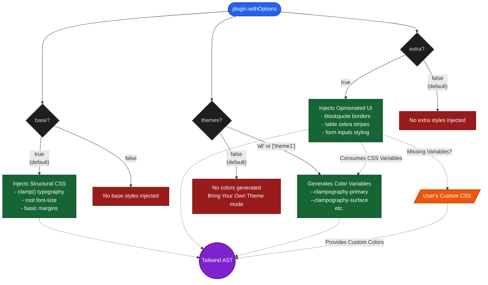

# Clampography Configuration Flow

This document illustrates how the Clampography plugin processes configuration options (`base`, `extra`, `themes`) and how they interact to generate the final CSS.

## Plugin Architecture Diagram

## How It Works

1. **`base` (Structural)**: On by default. Provides the responsive mathematical foundation. It doesn't add colors, just sizes, spacing, and fluid `clamp()` functions.
2. **`extra` (Opinionated)**: Off by default. Adds advanced visual polish to specific HTML elements (like borders, shadows, backgrounds). It relies heavily on CSS variables for its colors.
3. **`themes` (Colors)**: Off by default. Automatically generates and injects color palettes. 
   - If `extra` is **ON** but `themes` is **OFF**, the plugin enters **Bring Your Own Theme (BYOT)** mode. The structures will render, but the developer must define `--clampography-*` variables in their own CSS to colorize the components.
