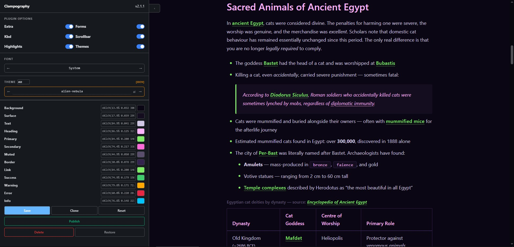

# Dev Server (Theme Editor)

The Clampography dev server is a local development tool for previewing typography, testing all module combinations, and managing themes - including creating, editing, publishing, and deleting them.


[Bun](https://bun.sh/docs/installation) is required to run the development environment, because the dev server relies on [Bun's native APIs](https://bun.com/docs/runtime/bun-apis).



## Starting the Server

```bash
bun run dev
```

The server starts at **http://localhost:3000**

## What It Does on Startup

On every start, the server pre-builds **64 CSS variants** — one for every possible combination of the optional modules (`themes`, `extra`, `forms`, `kbd`, `scrollbar`, `highlights`). These are built in parallel and cached in memory for zero-latency serving during the session.

## CSS Variant Naming

Each variant is addressable by a suffix composed of the first letter of each active module:

| Letter | Module |
|--------|-----------|
| `t` | themes |
| `e` | extra |
| `f` | forms |
| `k` | kbd |
| `s` | scrollbar |
| `h` | highlights |
| `n` | none (all off) |

**Examples:** `/css/tefk.css` (themes + extra + forms + kbd), `/css/te.css` (themes + extra), `/css/n.css` (base only).

## Theme Editor

The UI at `http://localhost:3000` includes a full theme editor that allows you to:

- **Preview** any theme instantly across all typography elements
- **Switch** between module combinations on the fly
- **Create** new themes by cloning an existing one
- **Edit** theme colors live with a color picker (changes reflect immediately)
- **Rename** themes
- **Delete** themes
- **Publish** experimental themes → moves them from `dev/themes-dev.js` to `src/themes.js` (official)
- **Unpublish** official themes → moves them back to `dev/themes-dev.js`

Every save/create/delete/publish action automatically regenerates both theme files and rebuilds all 64 CSS variants.

## Theme Files

| File | Purpose |
|------|---------|
| `src/themes.js` | **Official themes** — shipped with the package |
| `dev/themes-dev.js` | **Experimental themes** — dev-only, not published to npm |

> [!WARNING]
> Both files are auto-generated by the dev server. Do not edit them manually unless you know what you're doing.

## UI Controls & Keyboard Shortcuts

### UI Controls

| Control | Action |
|---------|--------|
| Theme dropdown | Switch active theme |
| Module toggles | Toggle `extra`, `forms`, `kbd`, `scrollbar`, `highlights` on/off |
| Color swatches | Click to open the color picker |
| **Clone** button | Create a copy of the current theme |
| **Save** button | Save changes to the current theme |
| **Delete** button | Permanently remove the current theme |
| **Publish / Unpublish** | Move theme between official and experimental |

### Keyboard Shortcuts

Keyboard shortcuts are active when not typing inside input fields or textareas.

| Shortcut | Action |
|----------|--------|
| `←` / `→` or `Space` | Navigate to previous / next theme |
| `Ctrl + ←` / `Ctrl + →` | Navigate to previous / next theme |
| `Ctrl + C` | Clone current theme |
| `Ctrl + S` | Save current theme |
| `Ctrl + R` | Reset theme to saved state |
| `Ctrl + P` | Publish / Unpublish current theme |
| `Delete` | Delete current theme |
| `Backspace` | Undo deletion / Restore deleted theme |
